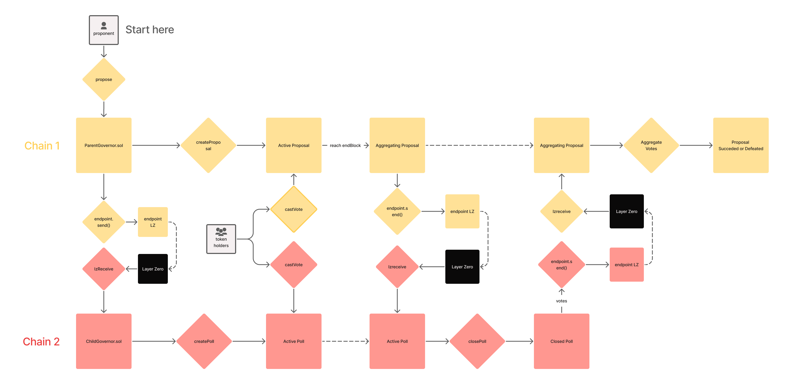

# AnyDAO Cross-chain Governance Protocol
enabling cross-chain voting
## Dependencies
This project uses Brownie. All hail Brownie!
Installing it via `pipx`:
```
pipx install eth-brownie
```
or via `pip`:
```
pip install eth-brownie
```
## Contracts Overview
This was created for the 2022 Avalanche Summit Hackathon to illustrate how we can do cross-chain governance using LayerZero. For simplicity, we decided to go with a parent-child pattern, where the proposal happens in one chain but multiple chains can vote in it, this pattern can be upgraded in the future to a more well-connected one.

### How it works
The governance model was heavily inspired by Compoound GovernorAlpha codebase, working quite similarly to it. 

We added that when a proposal is created in the parent chain, it triggers the creation of polls in the child chains. When the `endBlock` for the proposal arrives, the proposal enters in the Aggregating state, permitting anyone to close the side polls, sending the vote results to the parent chain, where it will be counted to change the proposal status to either Succeeded or Defeated.


